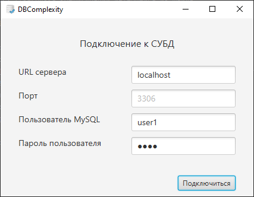
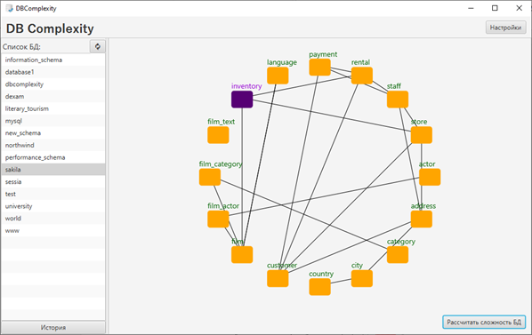
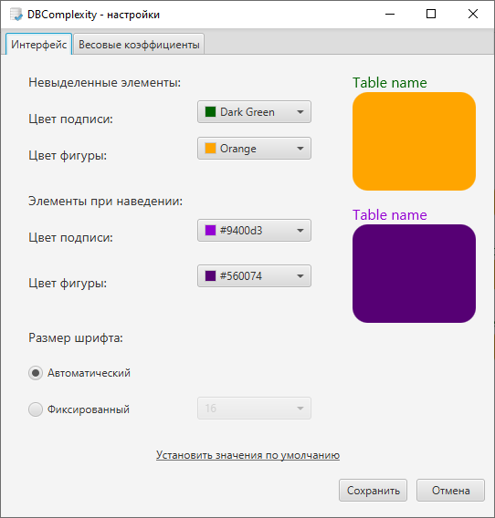
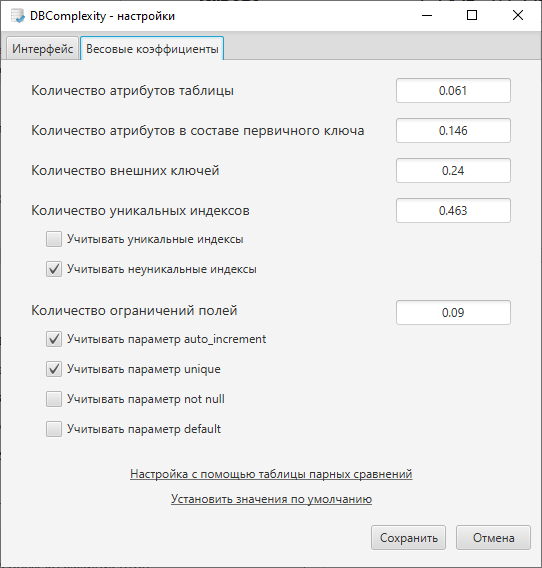
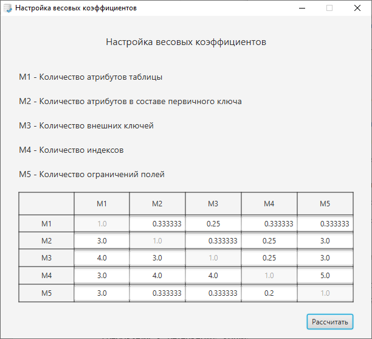
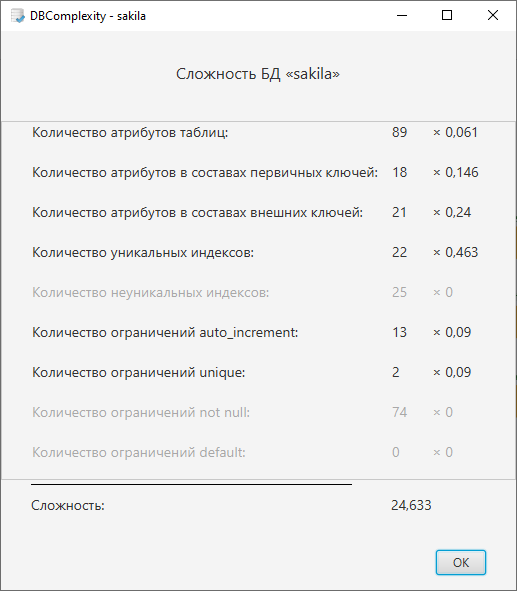

# DBComplexity
Приложение для оценки сложности БД MySQL на основе количественных метрик.

Приложение разработано под операционную систему Windows 10.
Для функционирования программы на устройстве должны быть уста-новлены следующие программные средства:
- комплект разработчика приложений: JDK (не ниже 8u231);
- СУБД MySQL (не ниже версии 5.5).

Приложение имеет следующие функциональные возможности:
- создание подключения к MySQL;
- получение списка баз данных;
- получение списка таблиц БД;
- формирование концептуального графа БД;
- визуализация концептуального графа БД;
- получение метрических характеристик таблицы;
- получение метрических характеристик БД;
- расчёт сложности таблицы;
- расчёт сложности БД;
- формирование отчёта о расчёте сложности;
- сохранение результатов расчёта сложности;
- настройка весовых коэффициентов метрических характеристик;
- настройка визуализации концептуального графа (цветовая палит-ра и размер шрифта).

## Описание работы приложения
При запуске приложения открывается окно с параметрами подключе-ния к MySQL серверу. Необходимо указать URL сервера (например, «localhost» или IP-адрес), порт (если требуется), а также логин и пароль пользователя MySQL. Первые два пункта сохраняются в системе при успешной авторизации.

Для создания концептуального графа пользователю необходимо выбрать БД. Каждая таблица БД на графе представлена прямоугольником с закругленными углами с подписью. Таблицы, связанные внешними ключами соединены линиями. При наведении мышкой на представление таблицы, она выделяется другим цветом. При нажатии открывается окно расчёта сложности таблицы.

В системе присутствует возможность настройки цветовой палитры и размера шрифта концептуального графа с возможность установки значений по умолчанию.

Для настройки весовых коэффициентов необходимо указать весовые коэффициенты следующих метрик:
- количество атрибутов таблицы;
- количество атрибутов в составе первичного ключа;
- количество внешних ключей;
- количество индексов;
- количество ограничений полей.
Имеется возможность выбора типа индексов (уникальный/неуникальный) и типа ограничений полей (auto_increment, unique, not_null, default). Есть возможность сброса параметров в значения по умолчанию (все весовые коэффициенты равны 1, все типы индексов и ограничений полей учитываются).

Помимо представленной выше реализации настройки весовых коэффициентов, есть возможность вызова расширенной функции настройки методом анализа иерархий Т. Саати. Для этого пользователю необходимо заполнить матрицу парных сравнений.

Пример расчёта сложности БД:

## Демонстрация работы

Ролик с демонстрацией работы программы доступен по ссылке: https://vk.com/video208886744_456239262
> Дополнительный ролик (более поздняя версия, но плохой звук): https://vk.com/video208886744_456239280
